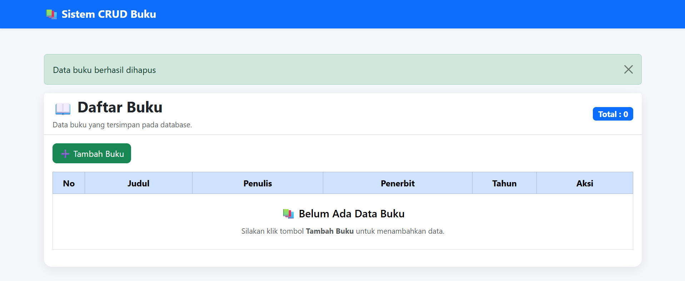
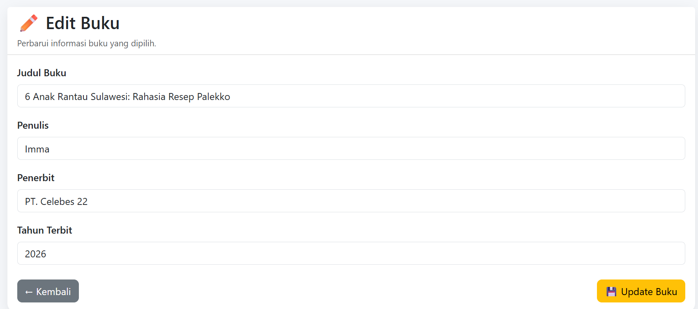

# 📚 Sistem CRUD Buku Laravel

## Deskripsi Project

Project ini merupakan aplikasi **CRUD (Create, Read, Update, Delete)** sederhana yang dibangun menggunakan **Laravel** dengan menerapkan konsep **Model-View-Controller (MVC)**.

Project ini dibuat sebagai tugas **Ujian Khusus Pemrograman Website** dengan memanfaatkan **Artificial Intelligence (AI)** sebagai asisten dalam proses pengembangan aplikasi.

---

# Fitur Aplikasi

Aplikasi memiliki fitur sebagai berikut:

- ✅ Menampilkan daftar buku
- ✅ Menambahkan data buku
- ✅ Mengubah data buku
- ✅ Menghapus data buku
- ✅ Validasi input
- ✅ Menggunakan Bootstrap untuk antarmuka
- ✅ Menggunakan MySQL sebagai database

---

# Teknologi yang Digunakan

- Laravel
- PHP 8.2
- MySQL
- Bootstrap 5
- Composer
- Git
- GitHub

---

# Struktur MVC

Project menerapkan konsep MVC (Model-View-Controller):

Model

- Buku.php

Controller

- BukuController.php

View

- index.blade.php
- create.blade.php
- edit.blade.php

Routing

- routes/web.php

---

# Cara Menjalankan Project

## 1. Clone Repository

```bash
git clone https://github.com/USERNAME/UK_Pemrograman.git
```

## 2. Masuk ke Folder Project

```bash
cd UK_Pemrograman
```

## 3. Install Dependency

```bash
composer install
```

## 4. Copy File Environment

```bash
cp .env.example .env
```

atau pada Windows:

```bash
copy .env.example .env
```

---

## 5. Generate Application Key

```bash
php artisan key:generate
```

---

## 6. Konfigurasi Database

Edit file `.env`

```env
DB_CONNECTION=mysql
DB_HOST=127.0.0.1
DB_PORT=3306
DB_DATABASE=crud_buku
DB_USERNAME=root
DB_PASSWORD=
```

---

## 7. Jalankan Migration

```bash
php artisan migrate
```

---

## 8. Menjalankan Project

```bash
php artisan serve
```

Kemudian buka browser:

```
http://127.0.0.1:8000/bukus
```

---

# Pengujian CRUD

Aplikasi telah berhasil diuji dengan skenario berikut:

- Menampilkan data buku
- Menambahkan data buku
- Mengubah data buku
- Menghapus data buku

Semua fitur berjalan dengan baik.

---

# Screenshot

# Dokumentasi dan Screenshot

## 1. Halaman Dashboard

Halaman utama aplikasi CRUD Buku setelah berhasil dijalankan menggunakan Laravel.



---

## 2. Halaman Daftar Buku

Halaman ini menampilkan seluruh data buku yang tersimpan pada database. Pengguna dapat menambah, mengubah, maupun menghapus data buku.


---

## 3. Form Tambah Buku

Halaman ini digunakan untuk menambahkan data buku baru ke dalam database.


---

## 4. Form Edit Buku

Halaman ini digunakan untuk memperbarui data buku yang telah tersimpan.



---

## 5. Konfirmasi Hapus Buku

Sebelum data dihapus, sistem menampilkan dialog konfirmasi agar pengguna tidak menghapus data secara tidak sengaja.


---

## 6. Daftar Routing Laravel

Berikut merupakan daftar route yang dihasilkan menggunakan perintah:

```bash
php artisan route:list
```

Route tersebut menunjukkan implementasi Resource Controller untuk operasi CRUD.


# Prompt AI

---

# 🤖 Prompt AI yang Digunakan

Dalam pengembangan aplikasi CRUD Buku ini, saya menggunakan **ChatGPT** sebagai asisten pembelajaran dan pengembangan. AI digunakan untuk membantu memahami Laravel, konsep MVC, konfigurasi database, pembuatan fitur CRUD, penggunaan Git, perbaikan error, pengembangan antarmuka, serta penyusunan dokumentasi project.

Berikut prompt yang digunakan selama proses pengembangan aplikasi.

## 1. Prompt Utama Bimbingan Project

```text
Halo ChatGPT.

Mulai sekarang kamu berperan sebagai:

1. Senior Software Engineer dengan pengalaman lebih dari 20 tahun.
2. Dosen Senior Pemrograman Web dan Teknologi Informasi.
3. Praktisi Laravel dan Git.
4. Penulis modul praktikum.
5. Mentor yang membimbing saya dari awal hingga akhir tanpa melewatkan langkah penting.

Saya sedang mengerjakan Ujian Khusus Pemrograman Website.

Setiap mahasiswa wajib membuat satu modul praktikum berbasis AI menggunakan Laravel atau CodeIgniter 4 dengan menerapkan konsep Model-View-Controller atau MVC.

Modul harus menjelaskan secara runtut:

1. Instalasi framework.
2. Konfigurasi project.
3. Konfigurasi database.
4. Pembuatan Migration.
5. Pembuatan Model.
6. Pembuatan Controller.
7. Pembuatan View.
8. Routing.
9. Implementasi CRUD.
10. Pengujian aplikasi.
11. README.md.
12. Prompt AI.
13. Git.
14. Pull Request.

Ketentuan lainnya:

1. Minimal 10 commit.
2. Project harus di-push ke GitHub.
3. Membuat Pull Request ke branch main.
4. Seluruh langkah harus disertai screenshot seperlunya.

Bimbing saya secara bertahap. Untuk setiap tahap, jelaskan:

1. Tujuan tahap.
2. Penjelasan konsep.
3. Langkah-langkah secara rinci.
4. Perintah CMD atau Terminal yang harus dijalankan.
5. File yang harus diedit.
6. Penjelasan setiap kode.
7. Screenshot yang harus diambil.
8. Checklist sebelum lanjut.

Jangan melompat ke tahap berikutnya sebelum tahap sebelumnya selesai.

Jangan mengubah struktur project tanpa alasan.

Jangan memberikan kode tanpa menjelaskan fungsinya.

Gunakan best practice Laravel.

Jelaskan seperti dosen yang sedang mengajar mahasiswa yang baru belajar Laravel.
```

## 2. Prompt Verifikasi Repository Git

```text
Project Laravel saya sudah dipindahkan ke folder repository hasil fork GitHub.

Bantu saya memverifikasi apakah repository Git masih benar.

Jelaskan fungsi dan cara menggunakan perintah berikut:

git status
git remote -v
git branch
dir /a

Pastikan folder .git masih ada, branch yang digunakan adalah main, dan remote origin mengarah ke repository GitHub hasil fork milik saya.
```

## 3. Prompt Commit dan Push ke GitHub

```text
Bantu saya membuat commit pertama untuk project Laravel.

Jelaskan konsep working directory, staging area, commit, dan remote repository.

Berikan perintah Git yang benar untuk:

1. Menambahkan perubahan ke staging area.
2. Membuat commit.
3. Melihat histori commit.
4. Mengecek status repository.
5. Melakukan push ke GitHub.

Gunakan pesan commit yang singkat, jelas, dan sesuai dengan perubahan project.
```

## 4. Prompt Pemilihan Tema CRUD

```text
Bantu saya memilih tema CRUD Laravel yang sederhana, lengkap, dan mudah didokumentasikan untuk tugas praktikum.

Tema harus mendukung penerapan:

1. Migration.
2. Model.
3. Controller.
4. View.
5. Routing.
6. Create.
7. Read.
8. Update.
9. Delete.
10. Validasi form.

Pilih antara CRUD Mahasiswa atau CRUD Buku dan jelaskan alasan pemilihannya.
```

## 5. Prompt Konfigurasi Database

```text
Bimbing saya menghubungkan project Laravel dengan database MySQL menggunakan XAMPP dan phpMyAdmin.

Database yang digunakan bernama crud_buku.

Jelaskan fungsi konfigurasi berikut pada file .env:

DB_CONNECTION=mysql
DB_HOST=127.0.0.1
DB_PORT=3306
DB_DATABASE=crud_buku
DB_USERNAME=root
DB_PASSWORD=

Jelaskan juga cara membersihkan cache konfigurasi dan menguji koneksi Laravel dengan database.
```

## 6. Prompt Pembuatan Database MySQL

```text
Jelaskan langkah membuat database MySQL bernama crud_buku melalui phpMyAdmin.

Gunakan collation utf8mb4_unicode_ci.

Jelaskan screenshot apa yang harus diambil untuk membuktikan bahwa database berhasil dibuat.
```

## 7. Prompt Pembuatan Migration

```text
Bantu saya membuat migration Laravel untuk tabel bukus.

Tabel harus memiliki kolom:

1. id sebagai primary key.
2. judul.
3. penulis.
4. penerbit.
5. tahun_terbit.
6. created_at.
7. updated_at.

Berikan perintah Artisan untuk membuat migration.

Jelaskan isi method up dan down.

Jelaskan fungsi setiap kolom dan cara menjalankan migration ke database MySQL.
```

## 8. Prompt Pembuatan Model

```text
Bantu saya membuat Model Buku di Laravel.

Model harus terhubung dengan tabel bukus.

Tambahkan properti fillable untuk:

judul
penulis
penerbit
tahun_terbit

Jelaskan fungsi Model dalam konsep MVC.

Jelaskan juga fungsi protected fillable dan hubungannya dengan mass assignment.
```

## 9. Prompt Pembuatan Resource Controller

```text
Bantu saya membuat BukuController menggunakan resource controller Laravel.

Jelaskan fungsi setiap method berikut:

index
create
store
show
edit
update
destroy

Gunakan Model Buku untuk mengambil, menyimpan, mengubah, dan menghapus data dari tabel bukus.
```

## 10. Prompt Method Index

```text
Bantu saya mengisi method index pada BukuController.

Method index harus mengambil seluruh data dari Model Buku dan mengirimkannya ke view bukus.index.

Jelaskan fungsi Buku::all(), compact(), dan return view().
```

## 11. Prompt Method Create dan Store

```text
Bantu saya mengisi method create dan store pada BukuController.

Method create harus menampilkan halaman bukus.create.

Method store harus:

1. Menerima data form.
2. Melakukan validasi.
3. Menyimpan data buku.
4. Mengarahkan pengguna kembali ke halaman daftar buku.
5. Menampilkan pesan sukses.

Field yang digunakan adalah judul, penulis, penerbit, dan tahun_terbit.
```

## 12. Prompt Method Edit dan Update

```text
Bantu saya mengisi method edit dan update pada BukuController.

Method edit harus mencari data buku berdasarkan id dan menampilkan halaman edit.

Method update harus:

1. Melakukan validasi.
2. Mencari data berdasarkan id.
3. Memperbarui data.
4. Mengarahkan pengguna ke halaman daftar buku.
5. Menampilkan pesan bahwa data berhasil diperbarui.

Jelaskan fungsi findOrFail() dan update().
```

## 13. Prompt Method Destroy

```text
Bantu saya mengisi method destroy pada BukuController.

Method destroy harus:

1. Mencari buku berdasarkan id.
2. Menghapus data dari database.
3. Mengarahkan pengguna kembali ke halaman daftar buku.
4. Menampilkan pesan bahwa data berhasil dihapus.

Jelaskan fungsi findOrFail() dan delete().
```

## 14. Prompt Pembuatan Routing

```text
Bantu saya membuat resource routing untuk BukuController pada file routes/web.php.

Gunakan Route::resource.

Jelaskan route yang dihasilkan untuk:

1. Menampilkan daftar buku.
2. Menampilkan form tambah.
3. Menyimpan data.
4. Menampilkan form edit.
5. Memperbarui data.
6. Menghapus data.

Jelaskan juga cara mengecek route menggunakan perintah php artisan route:list.
```

## 15. Prompt Pembuatan View Daftar Buku

```text
Bantu saya membuat file resources/views/bukus/index.blade.php.

Halaman harus menampilkan:

1. Judul halaman.
2. Tombol Tambah Buku.
3. Pesan sukses.
4. Tabel daftar buku.
5. Nomor urut.
6. Judul buku.
7. Penulis.
8. Penerbit.
9. Tahun terbit.
10. Tombol Edit.
11. Tombol Hapus.
12. Pesan jika data masih kosong.

Gunakan Bootstrap 5 agar tampilan rapi dan responsif.
```

## 16. Prompt Pembuatan Form Tambah Buku

```text
Bantu saya membuat file resources/views/bukus/create.blade.php.

Form harus memiliki input:

1. Judul buku.
2. Penulis.
3. Penerbit.
4. Tahun terbit.

Form harus menggunakan method POST, route bukus.store, CSRF token, validasi error, old input, tombol simpan, dan tombol kembali.

Gunakan Bootstrap 5.
```

## 17. Prompt Pembuatan Form Edit Buku

```text
Bantu saya membuat file resources/views/bukus/edit.blade.php.

Form harus menampilkan data lama dan dapat digunakan untuk memperbarui data buku.

Gunakan:

1. Route bukus.update.
2. Method POST.
3. @method('PUT').
4. @csrf.
5. old input.
6. Data dari variabel buku.
7. Pesan error validasi.
8. Tombol Update Buku.
9. Tombol Kembali.

Gunakan Bootstrap 5.
```

## 18. Prompt Validasi Form

```text
Bantu saya menambahkan validasi pada proses tambah dan edit buku.

Aturan validasi:

1. Judul wajib diisi.
2. Penulis wajib diisi.
3. Penerbit wajib diisi.
4. Tahun terbit wajib diisi.
5. Tahun terbit harus terdiri dari empat digit.

Tampilkan pesan error pada halaman create dan edit.

Pastikan nilai input sebelumnya tidak hilang saat validasi gagal.
```

## 19. Prompt Konfirmasi Penghapusan

```text
Bantu saya menambahkan tombol Hapus pada halaman daftar buku.

Gunakan form dengan method POST, CSRF token, dan method DELETE.

Tambahkan konfirmasi JavaScript sebelum data dihapus.

Pesan konfirmasi:

Apakah Anda yakin ingin menghapus data buku ini?
```

## 20. Prompt Memperbaiki Error Controller

```text
Saat menjalankan php artisan make:controller BukuController --resource, muncul pesan Controller already exists.

Jelaskan penyebabnya dan langkah yang harus dilakukan tanpa menghapus controller yang sudah berisi kode.
```

## 21. Prompt Memperbaiki Error Cache Database

```text
Saat menjalankan php artisan cache:clear, muncul error:

Table crud_buku.cache doesn't exist.

Bantu saya menganalisis penyebab error tersebut.

Periksa konfigurasi CACHE_STORE, SESSION_DRIVER, database yang digunakan, dan keberadaan tabel hasil migration.

Berikan solusi yang aman untuk lingkungan development.
```

## 22. Prompt Memperbaiki Error Tabel Tidak Ditemukan

```text
Saat membuka halaman bukus, Laravel menampilkan error:

Table crud_buku.bukus doesn't exist.

Bantu saya mencari penyebabnya.

Periksa:

1. Nama database.
2. Nama tabel.
3. Model Buku.
4. File migration.
5. Hasil migrate:fresh.

Jelaskan solusi yang benar menggunakan migration Laravel.
```

## 23. Prompt Memperbaiki Tabel yang Terhapus

```text
Tabel bukus sebelumnya dibuat menggunakan SQL manual.

Setelah menjalankan php artisan migrate:fresh, tabel bukus hilang karena belum memiliki file migration.

Bantu saya membuat migration create_bukus_table agar tabel bukus dapat dibuat kembali secara otomatis oleh Laravel.
```

## 24. Prompt Merapikan Halaman Daftar Buku

```text
Rapikan halaman index.blade.php menggunakan Bootstrap 5.

Tambahkan:

1. Navbar.
2. Background halaman.
3. Bootstrap Card.
4. Responsive table.
5. Total data buku.
6. Tombol tambah.
7. Tombol edit.
8. Tombol hapus.
9. Pesan sukses.
10. Empty state.
11. Konfirmasi hapus.

Jangan mengubah Controller, Model, Route, maupun alur CRUD.
```

## 25. Prompt Merapikan Halaman Tambah Buku

```text
Rapikan halaman create.blade.php menggunakan Bootstrap 5.

Buat tampilan yang konsisten dengan halaman daftar buku.

Tambahkan:

1. Navbar.
2. Card.
3. Label yang jelas.
4. Placeholder.
5. Validasi error.
6. Old input.
7. Tombol kembali.
8. Tombol simpan.

Jangan mengubah fungsi penyimpanan data.
```

## 26. Prompt Merapikan Halaman Edit Buku

```text
Rapikan halaman edit.blade.php menggunakan Bootstrap 5.

Buat tampilannya konsisten dengan halaman daftar dan tambah buku.

Tambahkan:

1. Navbar.
2. Card.
3. Validasi error.
4. Old input.
5. Nilai data lama.
6. Tombol kembali.
7. Tombol update.

Jangan mengubah fungsi update pada Controller.
```

## 27. Prompt Pengujian CRUD

```text
Bantu saya menyusun langkah pengujian aplikasi CRUD Buku.

Pengujian harus mencakup:

1. Membuka halaman daftar buku.
2. Menambahkan data buku.
3. Memastikan data masuk ke database.
4. Mengubah data buku.
5. Memastikan perubahan tersimpan.
6. Menghapus data buku.
7. Memastikan data sudah terhapus.
8. Menguji validasi form.
9. Mengecek routing.
10. Mengecek koneksi database.

Jelaskan screenshot yang perlu diambil untuk dokumentasi.
```

## 28. Prompt Penyusunan README

```text
Bantu saya menyusun README.md untuk project Sistem CRUD Buku Laravel.

README harus berisi:

1. Judul project.
2. Deskripsi project.
3. Fitur aplikasi.
4. Teknologi yang digunakan.
5. Struktur MVC.
6. Persyaratan sistem.
7. Cara clone repository.
8. Cara install dependency.
9. Cara menyalin file environment.
10. Cara membuat application key.
11. Konfigurasi database.
12. Cara menjalankan migration.
13. Cara menjalankan server.
14. Cara mengakses aplikasi.
15. Pengujian CRUD.
16. Dokumentasi screenshot.
17. Prompt AI.
18. Identitas pembuat.

Gunakan format Markdown yang rapi dan siap ditampilkan di GitHub.
```

## 29. Prompt Dokumentasi Screenshot

```text
Bantu saya menambahkan dokumentasi screenshot ke README.md.

Screenshot yang tersedia adalah:

1. Dashboard.
2. Daftar Buku.
3. Form Tambah Buku.
4. Edit Buku.
5. Alert Hapus Buku.
6. Route List.

Buat judul, deskripsi singkat, dan kode Markdown untuk menampilkan setiap gambar dari folder docs/screenshots.
```

## 30. Prompt Dokumentasi Git

```text
Bantu saya mengelola histori Git untuk memenuhi ketentuan minimal 10 commit.

Berikan rekomendasi pesan commit yang jelas untuk setiap tahap, seperti:

1. Instalasi Laravel.
2. Konfigurasi database.
3. Pembuatan Model.
4. Pembuatan Controller.
5. Implementasi Create dan Read.
6. Implementasi Update.
7. Implementasi Delete.
8. Perbaikan tampilan.
9. Dokumentasi screenshot.
10. Dokumentasi prompt AI.

Jelaskan cara mengecek jumlah commit dan melakukan push ke GitHub.
```

## 31. Prompt Pull Request

```text
Project saya berasal dari hasil fork repository dosen.

Bantu saya membuat Pull Request dari repository hasil fork milik saya ke repository dosen.

Pastikan:

1. Source repository berasal dari akun GitHub saya.
2. Source branch berisi project yang sudah selesai.
3. Base repository mengarah ke repository dosen.
4. Base branch adalah main.
5. Judul Pull Request jelas.
6. Deskripsi Pull Request menjelaskan isi project.
7. Semua commit sudah di-push sebelum Pull Request dibuat.
```

## Peran AI dalam Pengembangan

ChatGPT digunakan untuk membantu proses berikut:

1. Memahami konsep Laravel dan MVC.
2. Memahami penggunaan Migration, Model, Controller, View, dan Routing.
3. Menyusun struktur aplikasi CRUD Buku.
4. Menjelaskan fungsi kode.
5. Membantu menemukan penyebab error.
6. Memberikan solusi debugging.
7. Membantu memperbaiki antarmuka menggunakan Bootstrap.
8. Membantu menyusun dokumentasi project.
9. Membantu mengelola commit Git.
10. Membantu menyiapkan Pull Request.

AI digunakan sebagai alat bantu pembelajaran. Seluruh kode dan saran yang diberikan AI diperiksa, disesuaikan, dijalankan, dan diuji kembali sebelum diterapkan pada project.
AI yang digunakan:

- ChatGPT

---

# Author

Nama : Muhammad Farhan

Repository dibuat sebagai tugas Ujian Khusus Pemrograman Website.